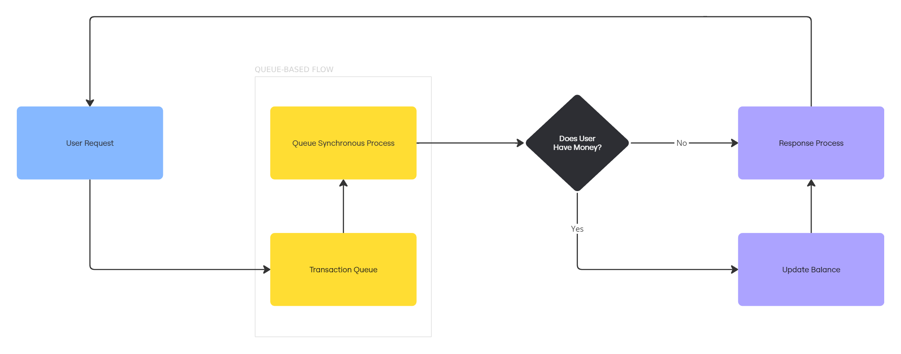

# CajuBeneficiosApi

Aplicação desenvolvida em [Python 3.12.3](https://python.org), focada na autorização de transações financeiras realizadas com cartões de crédito de benefícios, com saldo distribuído em categorias específicas.

# Armazenamento de Dados

Esta aplicação possui armazenamento em banco de dados MongoDB, portanto, é necessário que o banco esteja disponível antes do seu consumo pela aplicação.

Com o objetivo de minimizar possíveis problemas de concorrência na atualização de dados, e assumindo que conflitos entre transações são improváveis ainda que possam ocorrer, foi implementado o uso de [bloqueio otimista](...) com base no autogerenciamento do campo [revision_id](https://beanie-odm.dev/tutorial/revision) das collections.

Outras possíveis soluções podem ser exploradas caso o bloqueio otimista não se mostre suficientemente eficiente. Por exemplo:

1. Bloqueio Pessimista: Quando uma transação é iniciada, os dados que serão modificados são bloqueados, impedindo que outras transações acessem esses dados até que o bloqueio seja liberado.

2. Fila de Transações: Transações são processadas sequencialmente por meio de uma fila, que gerencia as requisições simultâneas, como ilustrado no fluxograma abaixo:



Dependendo das necessidades do sistema, outras opções para arquiteturas distribuídas podem ser exploradas, como Sagas, Transações Distribuídas e 2PC (Two-Phase Commit).

# Instalação

É necessário que o ambiente escolhido para instalação possua os recursos listados abaixo previamente instalados e configurados:

```
Make
Docker
```

A partir deste ponto, basta rodar o seguinte comando para instalar a aplicação:

```
$ make install
```

Além da instalção de todas as dependências, ao final da execução, testes automatizados e rotinas relacionadas serão executadas. Caso seja necessária a execução individual das rotinas, basta utilizar o comando `make <option>`.

Para exibir a lista de rotinas disponníveis, execute o comando `make` ou `make help`.

# Variáveis de Ambiente

Edite o arquivo `.env` para alterar as configurações de ambiente da aplicação. Após as alterações (se necessário for) reinicialize a aplicação para que as novas configurações sejam aplicadas.

Em ambientes externos voltados a staging e production, as variáveis de ambiente são encriptadas e estão localizadas no diretório `.k8s`, que também possui configurações adicionais relacionadas ao deploy, utilizando `kubernetes`.

Para encriptar ou desencripar as variáveis de ambiente de staging e production, é necessario que a infra esteja devidadamente alinhada com esta aplicação, porém, este recurso não se faz necessário e não será devidamente documentado neste repositório, ainda assim, é funcional e está devidamente implementado.

# Recursos Disponíveis

Todas os detalhes de utilização estão disponibilizados na documentação da aplicação, ainda assim, é válido lembrar que, para todas as rotas com exceção das de documentação e monitoramento, é necessário o envio do header `Authorization` preenchido com um Bearer token, desta forma, a aplicação validará o acesso aos recursos disponíveis.

* Para gerar um token válido, acesse o site do [JWT](https://jwt.io), altere a data de expiração utilizando a mesma chave de segurança configurada nas variáveis de ambiente e sem encodar em Base64.

```
| ----------------------------------- |
| Header                              |
| ----------------------------------- |
| {                                   |
|     "alg": "HS256",                 |
|     "typ": "JWT"                    |
| }                                   |
| ----------------------------------- |
| Payload                             |
| ----------------------------------- |
| {                                   |
|     "exp": 1916239022               |
| }                                   |
| ----------------------------------- |
| Verify Signature                    |
| ----------------------------------- |
| HMACSHA256(                         |
|     base64UrlEncode(header) + "." + |
|     base64UrlEncode(payload),       |
|     [ "secret" ]                    |
| ) [ ] secret base64 encoded         |
| ----------------------------------- |
```

# Inicialização

Para inicializar o serviço, basta executar o comando abaixo.

```
$ make run
$ make run-debug
```

Ao final da inicialização, o serviço estará disponível na seguinte url `http://localhost:8000`.

* Certifique-se de atribuir valor à variável de ambiente `JWT_SECRET` para que a aplicação possa validar a assinatura do token de acesso durante o uso da aplicação. Não há formato definido para a secret, porém, recomenda-se a utilização de um hash de 32 bits ou semelhante.

* O modo debug é indicado para fase de desenvolvimento da aplicação, permitindo o uso de breakpoints a partir do "start" das configurações `Api: Launch` ou `Api: Attach` no `VSCode`.

# Documentação

Os arquivos de documentação disponibilizados no diretório `.docs` podem ser importados no `Postman` para uso da aplicação em ambiente local. Caso prefira, a documentação pode ser acessada também através da url abaixo:

```
https://documenter.getpostman.com/view/...
```

Há também a documentação do `Swagger`, que é gerada a partir do código da aplicação e pode ser acessada ao inicializá-la em modo debug (ambiente de desenvolvimento) através da seguinte url:

```
http://localhost:8000/docs
```

# Monitoramento

A partir de ferramentas de instrumentação de código, a rota `/metrics` foi implementada para dispor de dados, que serão monitorados pelo `Prometheus`. Para ter aceso aos dashboards pré-configurados no `Grafana`, basta executar o comando `make monitoring` e acessar as url abaixo:

```
http://localhost:3000 (Prometheus)
http://localhost:3001 (Grafana)
```

* As url podem levar alguns minutos para se tornarem acessíveis, o Grafana demora um pouco na primeira inicialização do container dockerizado.

# Melhorias Necessárias

* Implementar o versionamento de rotas a partir de headers
* Integrar ferramentas para registro de eventos, erros e afins
* Incrementar testes e documentação levando em consideração outros cenários de uso
* Melhorar recursos do exception handler

# Pricipais Tecnologias Utilizadas

* [Poetry](https://python-poetry.org)
* [FastAPI](https://fastapi.tiangolo.com)
* [Pydantic](https://docs.pydantic.dev/latest)
* [MongoDB](https://www.mongodb.com)
* [Faker](https://faker.readthedocs.io/en/master)
* [Swagger](https://swagger.io)
* [Docker](https://docs.docker.com)
* [Kubernetes](https://kubernetes.io/pt-br)
* [Postman](https://www.postman.com)
* [VSCode](https://code.visualstudio.com)
